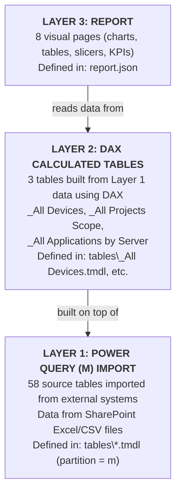

# Module 01: Getting Started

**Estimated time: 1 hour**

Welcome to the first module of the TRoI Power BI learning course. This module introduces the foundational concepts you need before diving into the model itself. By the end of this module, you will understand what Power BI is, why the project is stored as text files instead of a single binary, and how the three-layer architecture of the TRoI model works.

---

## Table of Contents

1. [What is Power BI?](#1-what-is-power-bi)
2. [What is PBIP Format?](#2-what-is-pbip-format)
3. [TMDL -- Tabular Model Definition Language](#3-tmdl----tabular-model-definition-language)
4. [The Three-Layer Architecture](#4-the-three-layer-architecture)
5. [Folder Walkthrough](#5-folder-walkthrough)
6. [Hands-On Exercise](#6-hands-on-exercise)
7. [Key Takeaways](#7-key-takeaways)

---

## 1. What is Power BI?

Power BI is Microsoft's business intelligence platform for data visualization and analysis. It lets you connect to data sources, transform and model the data, and then build interactive visual reports -- charts, tables, KPI cards, slicers -- that help people understand what the data means.

There are two main components you will encounter:

- **Power BI Desktop** -- The free Windows application where you author (build) your data models and reports. This is where you will do all of your work with the TRoI model. You install it from the Microsoft Store or the Power BI website.
- **Power BI Service** -- The cloud platform (app.powerbi.com) where published reports are shared with other people in the organization. You will not need to interact with the Service to learn from this course, but it is helpful to know that it exists as the publishing destination.

### Two Key Halves: Semantic Model and Report

Every Power BI project is made up of two halves:

1. **Semantic Model** (formerly called a "dataset") -- This is the data side. It contains your tables, the relationships between them, calculated columns, measures, and the queries that fetch data from external sources. Think of it as the engine under the hood.
2. **Report** -- This is the visual side. It contains pages with charts, tables, slicers, and other visual elements that display data from the semantic model. Think of it as the dashboard on top of the engine.

The TRoI project has both: a semantic model with 61 tables and a report with 8 pages. You will explore both throughout this course.

### Import Mode vs. DirectQuery

Power BI supports two fundamentally different ways to get data:

- **Import mode** -- Power BI pulls a snapshot of the data into its own internal storage. The data lives inside the model file. Queries and visuals run against this local copy, which makes them fast. The tradeoff is that the data is only as fresh as the last time you refreshed it.
- **DirectQuery** -- Power BI sends queries to the external data source in real time every time someone interacts with a report. The data is always current, but performance depends on the speed of the source system.

**The TRoI model uses import mode exclusively.** There is no DirectQuery. Every table is a snapshot of data pulled from SharePoint-hosted Excel and CSV files (plus one web-scraped HTML table from the intranet). When you open the model, you are looking at the data as it was at the time of the last refresh.

This is an important concept to keep in mind: if someone tells you that a server is missing from the report, the first question to ask is whether the data has been refreshed recently.

---

## 2. What is PBIP Format?

### The Traditional Format: `.pbix`

Traditionally, a Power BI project is saved as a single `.pbix` file. This is a binary archive (similar to a ZIP file) that bundles together the semantic model, the report layout, and the data itself into one opaque blob.

The `.pbix` format works fine for individual use, but it has significant limitations:

- **No version control.** You cannot meaningfully track changes in Git because the file is binary. A `git diff` shows nothing useful.
- **No code review.** You cannot open a pull request to review what changed in a data model update.
- **No collaboration.** Two people cannot work on different parts of the model at the same time and merge their changes.
- **No text search.** You cannot search across your model definitions with tools like `grep` or your code editor's search function.

### The Modern Format: `.pbip` (Power BI Project)

The `.pbip` format solves these problems by storing everything as plain text files in a folder structure. Instead of one binary blob, you get:

- A `.pbip` entry-point file (a small JSON file that tells Power BI Desktop where to find the semantic model and report).
- A `SemanticModel` folder containing `.tmdl` files (one per table, plus files for relationships, expressions, and model metadata).
- A `Report` folder containing a `report.json` file that defines the visual pages.

Because everything is plain text, you can:

- **Use Git** to track every change to every table, relationship, and measure.
- **Diff changes** to see exactly what was added, removed, or modified.
- **Review changes** in pull requests before they go live.
- **Search** across the entire model using standard text search tools.
- **Read and understand** the model structure without opening Power BI Desktop.

**This project uses the `.pbip` format.** That is why you see folders and `.tmdl` files in the repository instead of a single `.pbix` file.

### How to Open a PBIP Project

The entry point is the `.pbip` file in the root of the project:

```
True Reflection of Inventory (TRoI).pbip
```

Double-click this file (or right-click and choose "Open with Power BI Desktop") to open the entire project -- semantic model and report together -- in Power BI Desktop. You do not need to open any of the individual `.tmdl` files in Power BI Desktop; those are for reading and editing in a text editor or code editor like VS Code.

---

## 3. TMDL -- Tabular Model Definition Language

TMDL (Tabular Model Definition Language) is the plain-text file format that Power BI uses to define semantic models in the `.pbip` format. Each `.tmdl` file is a human-readable text file that defines tables, columns, measures, relationships, or expressions.

You do not need to memorize the TMDL syntax right now. Later modules will walk through it in detail. For now, the goal is to recognize the key files and understand what role each one plays.

### Key TMDL Files in This Project

All of these files live under:

```
True Reflection of Inventory (TRoI).SemanticModel\definition\
```

Here are the important ones:

| File | What It Contains |
|------|-----------------|
| `model.tmdl` | Model metadata: culture settings, data access options, all 9 query groups, the ordered list of all 61 table references, and Power BI version annotations. This is the "table of contents" for the model. |
| `relationships.tmdl` | All 22 relationships between tables. Each relationship specifies a "from" column and a "to" column, linking two tables together. |
| `expressions.tmdl` | 3 custom M functions (`ExpandSubnet`, `ConvertToMACAddress`, `ConvertIPToDecimal`), 1 parameter (`ApplicationCataloguePath`), 1 expression-table (`Ops Theater RAETSMARINE Apps`), and 3 diagnostics queries. |
| `tables\*.tmdl` | 61 individual table definition files, one per table. Each file defines the table's columns (name, data type, format), any measures, and the data source query (either an M query for imported tables or a DAX expression for calculated tables). |
| `cultures\en-US.tmdl` | Localization settings for the model (language, date/number formatting). |

### A Quick Look at TMDL Syntax

Here is a simplified excerpt from the `Active Directory Computers.tmdl` file to give you a feel for the format:

```
table 'Active Directory Computers'
    lineageTag: a17eed04-3c09-4d8a-a337-9a76fc2c9e6f

    column Name
        dataType: string
        lineageTag: 65502202-2279-4eb6-ae32-e846ddd28c13
        summarizeBy: none
        sourceColumn: Name

    column Enabled
        dataType: boolean
        formatString: """TRUE"";""TRUE"";""FALSE"""
        lineageTag: ef5b0a59-6f01-4850-a0f9-bea45c65b300
        summarizeBy: none
        sourceColumn: Enabled

    column OS
        dataType: string
        lineageTag: 61079eb5-82c6-497f-bf83-e3fa7bc980cc
        summarizeBy: none
        sourceColumn: OS

    partition 'Active Directory Computers' = m
        mode: import
        queryGroup: 'Child Queries\Resource Management'
        source =
                let
                    Source = Excel.Workbook(Web.Contents("https://...sharepoint.com/.../MSA%20Report.xlsx"), null, true),
                    AllServers_Table = Source{[Item="AllServers",Kind="Table"]}[Data],
                    ...
                in
                    #"Renamed Columns"
```

A few things to notice:

- **`table 'Active Directory Computers'`** -- Declares the table name. This is the name that appears in Power BI Desktop.
- **`column Name`** -- Defines a column, including its data type (string, boolean, dateTime, int64, etc.) and how Power BI summarizes it by default.
- **`lineageTag`** -- A unique identifier (GUID) that Power BI uses internally to track the object. You can generally ignore these.
- **`partition ... = m`** -- Indicates that this table's data comes from a Power Query (M language) source. The `mode: import` line confirms it uses import mode. The `source = let ... in ...` block is the actual M query that fetches and transforms the data.
- **`annotation`** -- Metadata entries used by Power BI Desktop. You can ignore these when reading.

Contrast this with a calculated table like `_All Devices`, which uses `partition ... = calculated` instead of `partition ... = m`. We will cover that distinction in Section 4.

Do not worry about understanding every line right now. The purpose of this section is to establish that TMDL files are readable, structured, and predictable. You will build fluency with the syntax as you progress through later modules.

---

## 4. The Three-Layer Architecture

This is the single most important concept in this module. The TRoI model is built in three layers, each depending on the one below it. Understanding these layers will give you a mental map for everything that follows in this course.



### Layer 1: Power Query (M) Import -- 58 Source Tables

The foundation of the model. Power Query uses the M language to define **how** data is fetched from external sources and **what** transformations are applied before the data enters the model.

In the TRoI model, 58 tables are imported this way. The data comes primarily from SharePoint-hosted Excel workbooks and CSV files, with one exception: a table called `Ops Theater RAETSMARINE Apps` that scrapes an HTML table from an internal web page.

These 58 source tables are organized into 9 query groups (think of these as folders within Power Query):

| Query Group | Purpose | Example Tables |
|------------|---------|----------------|
| **Hosting Platforms** | Where servers run | VMware VMs, VMware Hosts, Azure VMs, SolarWinds VMs |
| **Asset Management & Inventory** | What we know about assets | Active Directory Computers, ConfigMgr All Devices, Snow Computers, ServiceNow CMDB |
| **Monitoring Tools** | Security and monitoring data | Qualys Assets, Symantec Endpoint Protection Devices, QRadar Log Sources, Panaseer All Devices |
| **Mapping** | Lookup and normalization tables | Mapping Location, Mapping DomainFQDN to DomainNetBIOS, Mapping VM to ServerName |
| **Merged** | Combined views across sources | Merged IP Addresses, Merged Subnets, Merged SQL Databases, Merged SQL Instances |
| **Network** | Network infrastructure data | Diamond IP IPControl Subnets, Network Team Global IP Address Allocation |
| **Other Teams** | Data from other IT teams | Citrix Team Published Applications, DR Manager Important Business Services, Environments Team |
| **Functions** | Reusable M helper functions | ExpandSubnet, ConvertToMACAddress, ConvertIPToDecimal |
| **Resource Management** | Active Directory data | Active Directory Computers |

Think of Layer 1 as the **ETL layer** (Extract, Transform, Load). It extracts data from 15+ different IT systems, transforms it (uppercasing server names, joining domain lookups, removing duplicates, changing data types), and loads it into the model.

You can see Layer 1 in action inside Power BI Desktop by opening the Power Query Editor (Home tab, then "Transform Data"). Each query in the left panel corresponds to one of these 58 tables.

### Layer 2: DAX Calculated Tables -- 3 Tables

Layer 2 is where the model does its heaviest analytical work. Three tables are not imported from external sources; instead, they are **calculated** from the Layer 1 data using DAX (Data Analysis Expressions), Power BI's formula language.

These three tables are:

**`_All Devices`** -- The core table of the entire model. It takes servers from all 15+ source systems and combines them into a single unified list using a multi-stage UNION and EXCEPT (deduplication) process. After deduplication, it adds 30+ calculated columns that enrich each server record with information pulled from across the model using `LOOKUPVALUE` fallback chains. It also contains 10 measures used in report visuals.

This table answers the fundamental question: *"What is the single, deduplicated list of all servers we know about, and what do we know about each one from every system?"*

**`_All Projects Scope`** -- A filtered cross-join of `_All Devices` with application mapping data. It produces one row per server-application combination, filtered to exclude certain locations (AVS and New ALZ) and client endpoints. This table supports the project planning and migration scoping report pages.

**`_All Applications by Server`** -- Similar to `_All Projects Scope` but without the location filtering, and with an added End of Life flag for Windows Server 2008 and 2012 systems.

In TMDL files, you can identify a calculated table by its partition type:

```
partition '_All Devices' = calculated
    mode: import
    source = ...DAX expression here...
```

Notice `= calculated` instead of `= m`. This tells Power BI that the table's data is computed from other tables in the model rather than imported from an external source.

Layer 2 is covered in depth in Modules 9 through 12. For now, just remember: three tables are built from the imported data using DAX, and `_All Devices` is the most important one.

### Layer 3: Report Pages -- 8 Pages

The report layer is what end users see and interact with. It sits on top of the semantic model (Layers 1 and 2) and presents the data visually.

The TRoI report contains 8 pages:

| Page | Purpose |
|------|---------|
| **Server Inventory** | The primary dashboard showing the deduplicated device list with filters for source system presence, location, OS, and more |
| **Azure vNet** | Azure virtual network topology and VM placement |
| **Application Mapping Comparison** | Comparing application-to-server mappings across different data sources |
| **Asset Presence (WIP)** | Work-in-progress page analyzing which source systems know about which servers |
| **Project Planning** | Migration project scoping using `_All Projects Scope` data |
| **Citrix Published Applications** | Citrix-specific application inventory |
| **Databases** | SQL Server database and instance inventory across systems |
| **Residual Servers Post AVS Migration** | Servers that remain after VMware AVS migration |

The report is defined in a single (very large) JSON file:

```
True Reflection of Inventory (TRoI).Report\report.json
```

This file is approximately 62,000 tokens long. You will rarely need to read it directly; Power BI Desktop provides a graphical editor for working with report pages. Module 13 covers the report layer in detail.

### How the Layers Connect

The key insight is that **data flows upward**:

1. Layer 1 pulls raw data from 15+ external systems.
2. Layer 2 combines, deduplicates, and enriches that data into unified tables.
3. Layer 3 displays the enriched data as interactive visuals.

When you refresh the model in Power BI Desktop (Home tab, "Refresh"), this is what happens:

1. All 58 Power Query (M) tables re-fetch their data from SharePoint.
2. The 3 DAX calculated tables recompute based on the newly imported data.
3. The report visuals update to reflect the new data.

---

## 5. Folder Walkthrough

Now that you understand the concepts, let us walk through the actual project structure on disk. Open File Explorer or your code editor and navigate to the project root directory.

```
True Reflection of Inventory (TRoI).pbip
```
This is the entry point. Double-click to open the entire project in Power BI Desktop. It is a small JSON file that points to the SemanticModel and Report folders.

```
True Reflection of Inventory (TRoI).SemanticModel\
```
This folder contains the entire semantic model (Layers 1 and 2). Everything about the data -- tables, columns, relationships, measures, queries -- lives here.

```
True Reflection of Inventory (TRoI).SemanticModel\definition\
```
The `definition` subfolder is where the TMDL files live.

```
  definition\model.tmdl
```
The model metadata file. It lists all 9 query groups, all 61 table references (via `ref table` lines), and model-level settings like culture and Power BI version. Think of this as the table of contents.

Here is a sample of what the query group and table reference entries look like:

```
queryGroup 'Child Queries\Hosting Platforms'
    annotation PBI_QueryGroupOrder = 1

queryGroup 'Child Queries\Asset Management & Inventory'
    annotation PBI_QueryGroupOrder = 2

...

ref table 'Active Directory Computers'
ref table 'VMware VMs'
ref table 'Azure VMs'
ref table '_All Devices'
...
```

```
  definition\relationships.tmdl
```
All 22 relationships between tables. Each one specifies which column in one table connects to which column in another. For example:

```
relationship be452c2b-09be-ba58-59f9-5e9182f46423
    fromColumn: 'VMware VMs'.Host
    toColumn: 'VMware Hosts'.Host
```

This says: the `Host` column in the `VMware VMs` table is linked to the `Host` column in the `VMware Hosts` table.

```
  definition\expressions.tmdl
```
Custom M functions (reusable query logic), a parameter, an expression-table, and diagnostics queries. The three functions are:

- **`ExpandSubnet`** -- Takes a CIDR subnet (like `10.0.0.0/24`) and expands it into a list of all individual IP addresses.
- **`ConvertToMACAddress`** -- Converts a MAC address from dotted format (like `aabb.ccdd.eeff`) to colon-separated format (`aa:bb:cc:dd:ee:ff`).
- **`ConvertIPToDecimal`** -- Converts a dotted-decimal IP address to its decimal integer equivalent.

```
  definition\tables\
```
This directory contains 61 `.tmdl` files, one per table. Some important ones to be aware of:

- `Active Directory Computers.tmdl` -- Layer 1 source table with an M import query
- `VMware VMs.tmdl` -- Layer 1 source table for VMware virtual machines
- `_All Devices.tmdl` -- Layer 2 calculated table (the core of the model)
- `_All Projects Scope.tmdl` -- Layer 2 calculated table for project planning
- `_All Applications by Server.tmdl` -- Layer 2 calculated table for application mapping

The underscore prefix on `_All Devices`, `_All Projects Scope`, and `_All Applications by Server` is a naming convention to make the calculated tables sort to the top of alphabetical lists.

```
  definition\cultures\en-US.tmdl
```
Localization settings. Defines date and number formatting for the US English locale.

```
True Reflection of Inventory (TRoI).SemanticModel\DAXQueries\
  _All Devices.dax
```
A development-only DAX query file. This is used for testing and iterating on the `_All Devices` calculated table's DAX expression. **Important caveat:** the `.dax` file may differ from the live partition defined in `_All Devices.tmdl`. Specifically, the `.dax` file comments out the `SnowComputersFiltered` variable in the UNION, while the live partition includes it. Always treat the `.tmdl` file as the source of truth.

```
True Reflection of Inventory (TRoI).Report\
  report.json
```
The report definition. Contains all 8 report pages, their visual elements (charts, tables, slicers, KPI cards), layout positioning, formatting, and cross-filtering configuration. This file is very large (~62,000 tokens) and is best edited through Power BI Desktop's visual editor rather than by hand.

```
docs\
```
Generated documentation files (numbered 01 through 09) that describe the model's architecture, tables, relationships, and maintenance procedures. These were produced as reference material and may be useful as you progress through the course.

```
VMware VMs Check.pbip
VMware VMs Check.SemanticModel\
VMware VMs Check.Report\
```
A separate, smaller Power BI project with 6 tables and 4 relationships. This is a secondary model for VMware VM verification and is not part of the main TRoI learning path.

---

## 6. Hands-On Exercise

This exercise walks you through opening the TRoI model and exploring its structure in Power BI Desktop. It should take approximately 15 minutes.

### Prerequisites

- Power BI Desktop is installed on your machine.
- You have access to the project files at the repository root.

### Step 1: Open the Project

Navigate to the project root in File Explorer and double-click:

```
True Reflection of Inventory (TRoI).pbip
```

Power BI Desktop will open and load the model. This may take a minute or two as it initializes. If prompted about data source privacy levels, choose the option that allows combining data (the model requires it).

Note: If the data sources are not accessible (e.g., you are not connected to the corporate network or do not have SharePoint access), the model will still open, but some or all tables may show errors. That is fine for this exercise -- you can still explore the structure.

### Step 2: Explore the Report View

When the model finishes loading, you should be in **Report view** (the default view). Look at the bottom of the screen -- you will see tabs for each report page:

- Server Inventory
- Azure vNet
- Application Mapping Comparison
- Asset Presence
- Project Planning
- Citrix Published Applications
- Databases
- Residual Servers Post AVS Migration

Click on a few page tabs to see the different reports. Notice the variety of visuals: bar charts, tables, cards showing counts, slicers for filtering. This is Layer 3 in action.

### Step 3: Switch to Model View

On the left sidebar of Power BI Desktop, you will see three icons stacked vertically:

1. **Report view** (bar chart icon) -- where you are now
2. **Data view** (table/grid icon) -- shows raw table data
3. **Model view** (database diagram icon) -- shows tables and relationships

Click the **Model view** icon (the bottom one, which looks like a small database diagram with connected boxes). You should now see a diagram with tables represented as boxes and lines connecting them where relationships exist.

Look at the sheer number of tables. You should see 61 of them. Notice that some tables are connected by relationship lines and some are isolated. In particular, notice that `_All Devices`, `_All Projects Scope`, and `_All Applications by Server` have **no relationship lines** connecting them to other tables. This is by design -- they use `LOOKUPVALUE` in DAX instead of model relationships. This is a key architectural choice that Module 7 will explain in depth.

### Step 4: Switch to Data View

Click the **Data view** icon (the middle one, which looks like a grid/table). In the Fields pane on the right side, you will see a list of all tables. Click on any table name to see its data.

Try clicking on these tables to compare:

- **`Active Directory Computers`** -- This is a Layer 1 imported table. Notice the columns: Name, Enabled, Domain, IP Address, Last Logon, OS, etc. This is raw data pulled from a SharePoint Excel file.
- **`_All Devices`** -- This is a Layer 2 calculated table. Notice it has many more columns because it combines and enriches data from multiple source tables. Scroll right to see the full breadth of columns.

### Step 5: Open Power Query Editor

From the **Home** tab in the ribbon at the top, click **Transform Data**. This opens the Power Query Editor, which is the graphical interface for Layer 1.

In the left panel (Queries pane), you will see the query groups:

- Child Queries
  - Hosting Platforms
  - Asset Management & Inventory
  - Monitoring Tools
  - Mapping
  - Functions
  - Merged
  - Resource Management
  - Other Teams
- Diagnostics

Click on a few queries to see their data preview in the main panel. Click on **Active Directory Computers** and look at the "Applied Steps" panel on the right side -- each step is a transformation applied to the raw data. These steps correspond to the M code you saw earlier in the TMDL file.

Notice the three entries under **Functions**: `ExpandSubnet`, `ConvertToMACAddress`, and `ConvertIPToDecimal`. These are not tables -- they are reusable functions that other queries call.

### Step 6: Close Power Query Editor

Click **Close & Apply** (or just **Close** if you do not want to refresh the data) to return to Power BI Desktop.

### Step 7: Explore a TMDL File in Your Text Editor

Open your code editor (VS Code, Notepad++, or even Notepad) and navigate to:

```
True Reflection of Inventory (TRoI).SemanticModel\definition\tables\Active Directory Computers.tmdl
```

Read through the file. Compare what you see in the text file with what you saw in Power BI Desktop:

- The `column` definitions match the columns you saw in Data view.
- The `partition` section at the bottom contains the M query you saw in Power Query Editor's formula bar.
- The `dataType` values match the column types displayed in Power BI.

This is the core value of the PBIP format: the text files and the Power BI Desktop views are two representations of the same thing.

---

## 7. Key Takeaways

Here is what you should take away from this module:

**Power BI = Semantic Model + Report.** The semantic model is the data engine (tables, relationships, measures, queries). The report is the visual layer (pages, charts, slicers). Both are essential, and they are stored separately in the PBIP format.

**This project uses PBIP format, not .pbix.** Instead of a single binary file, the project is stored as plain-text files in a folder structure. This enables version control, code review, and text-based search. The `.pbip` file is the entry point -- double-click it to open everything in Power BI Desktop.

**TMDL is the text format for semantic models.** Each `.tmdl` file defines tables, columns, measures, or relationships in a human-readable syntax. The key files are `model.tmdl` (table of contents), `relationships.tmdl` (connections between tables), `expressions.tmdl` (functions and parameters), and the individual table files in the `tables\` directory.

**The model has three layers.** Layer 1 (Power Query / M) imports 58 tables from external sources. Layer 2 (DAX Calculated Tables) builds 3 analytical tables from the imported data, with `_All Devices` being the most important. Layer 3 (Report) presents the data visually across 8 pages.

**Data flows upward.** External sources feed Layer 1, Layer 1 feeds Layer 2, and Layers 1 and 2 feed Layer 3. A refresh re-runs this entire pipeline.

**`_All Devices` is the heart of the model.** It combines servers from 15+ systems into one deduplicated, enriched table. You will spend several modules (9, 10, 11) studying how it works.

---

## What is Next

In **Module 02: The Model Map**, you will get a bird's-eye view of all 61 tables organized by query group, understand what data each one holds, and learn which source system it comes from. This will give you the mental map you need before diving into individual tables and their Power Query logic in Module 03.

---

## Glossary

Terms introduced in this module:

| Term | Definition |
|------|-----------|
| **Power BI Desktop** | The free Windows application for authoring Power BI data models and reports. |
| **Power BI Service** | The cloud platform for publishing and sharing Power BI reports with others. |
| **Semantic Model** | The data model containing tables, relationships, columns, measures, and queries. Formerly called a "dataset." |
| **Report** | The visual layer containing pages with charts, tables, slicers, and other interactive elements. |
| **Import Mode** | A data connection mode where Power BI pulls a snapshot of the data into the model file. Queries run against this local copy. |
| **DirectQuery** | A data connection mode where Power BI queries the source system in real time. Not used in TRoI. |
| **`.pbix`** | The traditional Power BI file format -- a single binary archive containing everything. |
| **`.pbip`** | The modern Power BI Project format -- a folder of plain-text files. Used by this project. |
| **TMDL** | Tabular Model Definition Language -- the plain-text syntax used in `.tmdl` files to define semantic model objects. |
| **Power Query** | The data import and transformation engine in Power BI. Uses the M language. |
| **M Language** | The functional programming language used by Power Query to define data extraction and transformation steps. |
| **DAX** | Data Analysis Expressions -- the formula language used for calculated columns, measures, and calculated tables in the semantic model. |
| **Calculated Table** | A table whose data is computed from other tables in the model using a DAX expression, rather than imported from an external source. |
| **Measure** | A DAX formula that computes a value dynamically based on the current filter context (e.g., count of devices, sum of values). |
| **Partition** | The section of a TMDL table definition that specifies the data source -- either `= m` (Power Query import) or `= calculated` (DAX). |
| **Query Group** | An organizational folder within Power Query that groups related queries together (e.g., "Hosting Platforms," "Monitoring Tools"). |
| **Refresh** | The process of re-fetching data from all sources (Layer 1) and recomputing calculated tables (Layer 2). |
| **ETL** | Extract, Transform, Load -- the general pattern of pulling data from sources, cleaning/reshaping it, and loading it into a destination. Layer 1 performs ETL. |
