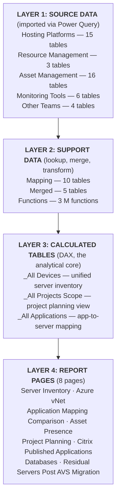

# Module 02: The Model Map

> **Prerequisites:** Module 01 completed (you understand the PBIP format, the three-layer architecture, and the folder structure).

---

## What You Will Learn

This module gives you a bird's-eye view of every table in the TRoI model. By the end, you will be able to name all 61 tables, know which query group each belongs to, and understand how the groups relate to each other. Keep this module as your reference map -- you will come back to it often.

---

## 1. Query Groups -- Your Organizational System

Open `model.tmdl` and you will see nine query groups defined near the top of the file. In Power Query Editor, these appear as folders in the left-hand Queries pane. Each group has a `PBI_QueryGroupOrder` annotation that controls its display position.

All nine groups are children of a parent group called `Child Queries`. The three DAX calculated tables sit outside this hierarchy entirely -- they have no query group because they are not Power Query tables.

Here are the groups, listed by their display order:

| Order | Query Group | Purpose |
|-------|-------------|---------|
| 0 | Resource Management | Active Directory and ConfigMgr device data |
| 1 | Hosting Platforms | Where servers live -- VMware, Azure, Azure Arc |
| 2 | Asset Management & Inventory | What we know about servers -- ServiceNow, Snow, Application Catalogue, DB inventories |
| 3 | Monitoring Tools | Security and monitoring coverage -- Qualys, SEP, QRadar, Panaseer, SolarWinds |
| 4 | Mapping | Lookup and normalization tables -- Location, Domain, Application, VLAN, VM names |
| 8 | Merged | Combined/derived tables -- IP addresses, subnets, SQL databases and instances |
| 9 | Functions | Custom M functions -- ExpandSubnet, ConvertToMACAddress, ConvertIPToDecimal |
| 9 | Diagnostics | Three diagnostic queries (legacy, can be ignored) |
| 10 | Other Teams | Data from Citrix, DR Manager, Environments Team, and Network Team |

Notice that Functions and Diagnostics share order 9. This is harmless -- Power BI sorts them alphabetically when orders match.

---

## 2. Complete Table Inventory

Below is every table in the model, organized by its actual query group assignment as recorded in the TMDL files. Each table includes a one-line description of what it contains.

### Hosting Platforms (15 tables)

These tables describe where servers physically or virtually reside.

| Table | Description |
|-------|-------------|
| `VMware VMs` | Virtual machines from 3 vCenters (SVCENT0005, AVSUKSouth, AVSUKWest), combined from RVTools exports |
| `VMware Hosts` | Physical ESXi host servers across all vCenters |
| `VMware Disks` | Virtual disk details per VM (size, type, controller) |
| `VMware Network` | Network adapter details per VM (MAC address, port group, VLAN) |
| `VMware Snapshots` | VM snapshot inventory (age, size, description) |
| `VMware Tools` | VMware Tools version and status per VM |
| `VMware CD` | Mounted CD/DVD media per VM |
| `Azure VMs` | Azure virtual machines (resource group, location, size, OS) |
| `Azure Disks` | Azure managed disk details (size, SKU, encryption) |
| `Azure VM Sizes` | Azure VM size/SKU reference data (vCPUs, memory) |
| `Azure Arc Machines` | Azure Arc-enrolled on-premises machines |
| `Azure Arc SQL Instances` | SQL Server instances discovered by Azure Arc |
| `Azure Arc SQL Databases` | SQL databases discovered by Azure Arc |
| `Azure SQL Virtual Machines` | Azure SQL VM resource details |
| `Azure VirtualNetworks` | Azure virtual network and subnet definitions |

### Resource Management (3 tables)

Despite the group name suggesting network focus, this group actually holds core asset management sources -- Active Directory and ConfigMgr.

| Table | Description |
|-------|-------------|
| `Active Directory Computers` | AD computer objects (Name, Domain, OS, IP address, Last Logon timestamp) |
| `ConfigMgr All Devices` | SCCM/ConfigMgr managed devices (hardware inventory, client status) |
| `ConfigMgr Encryption Status` | BitLocker encryption status from ConfigMgr |

### Asset Management & Inventory (16 tables)

The largest group. Contains ServiceNow, Snow Software, Application Catalogue data, database inventories, and several other asset-related sources.

| Table | Description |
|-------|-------------|
| `ServiceNow CMDB` | CMDB configuration items (Environment, Install Status, Owner, Support Group) |
| `ServiceNow Decommission Change Requests` | Decommission CHG records from ServiceNow |
| `ServiceNow Decommission Service Requests` | Decommission service request records from ServiceNow |
| `ServiceNow MSSQL Databases` | MSSQL database records from ServiceNow |
| `ServiceNow MSSQL Instances` | MSSQL instance records from ServiceNow |
| `Snow Computers` | Snow Software asset inventory (Manufacturer, Model, Processor cores, Last Scan) |
| `Snow SQL Servers` | Snow Software SQL Server discovery data |
| `Application Catalogue Wave Plan` | Migration wave assignments for applications |
| `Application Catalogue Working Catalogue` | Full application catalogue (Expected/Proposed DC Handling, ownership) |
| `Application Catalogue Discrepancies` | Discrepancies between the data model and the application catalogue |
| `Application Catalogue Missing From Data Model` | Applications present in the catalogue but absent from the data model |
| `Diamond IP IPControl Subnets` | IP address management (IPAM) subnet records |
| `DB Inventory System Databases` | Internal database inventory -- database records |
| `DB Inventory System Instances` | Internal database inventory -- instance records |
| `Environments Team Environment Management Database` | Environment management data from the Environments Team |
| `Ops Theater RAETSMARINE Apps` | Web-scraped server/application data from an intranet page (see note below) |

**Note on Ops Theater RAETSMARINE Apps:** This table is special. It is defined as an expression in `expressions.tmdl`, not as a file in the `tables/` folder. It scrapes an internal HTML page at `http://spdoca0001.raetsmarine.local/servers_func.html`. Despite being an expression-table, it belongs to the Asset Management & Inventory query group and counts toward the 61-table total.

### Monitoring Tools (6 tables)

Security scanners, endpoint protection, SIEM, and network monitoring sources.

| Table | Description |
|-------|-------------|
| `Qualys Assets` | Qualys vulnerability scanner inventory (OS, IP, last scan date, agent status) |
| `Symantec Endpoint Protection Devices` | SEP antivirus agent status and version |
| `QRadar Log Sources` | QRadar SIEM log source inventory |
| `Panaseer All Devices` | Panaseer security posture and control coverage data |
| `SolarWinds Nodes` | SolarWinds Orion monitored nodes (DeviceType, Node Category, IP, status) |
| `SolarWinds VMs` | SolarWinds VM discovery data (identifies Hyper-V hosted VMs) |

### Mapping (10 tables)

Lookup and normalization tables that translate values between source systems. These are the "glue" that lets the model connect data from different sources.

| Table | Description |
|-------|-------------|
| `Mapping Location` | Location code lookup (embedded as Base64-encoded JSON data in the M query) |
| `Mapping Manual Server To Location` | Manual server-to-location overrides for servers that cannot be automatically located |
| `Mapping Manual Missing Subnets` | Manual subnet-to-location entries for subnets not in Diamond IP |
| `Mapping Diamond IP IPControl Subnet to Location` | Diamond IP subnet-to-location mapping (derived from IPAM data) |
| `Mapping DomainFQDN to DomainNetBIOS` | Fully-qualified domain name to NetBIOS domain name lookup |
| `Mapping DomainNetBIOS to DomainFQDN` | NetBIOS to FQDN domain name lookup (bidirectional pair with the above) |
| `Mapping Server to Application` | Server-to-application mapping (many-to-many, used by calculated tables) |
| `Mapping Application to Application Catalogue` | Application name normalization -- maps raw names to catalogue-standard names |
| `Mapping VLAN to Application` | VLAN-to-application mapping |
| `Mapping VM to ServerName` | VM name to server name mapping (handles cases where VM name differs from hostname) |

### Merged (5 tables)

Combined and derived tables that consolidate data from multiple sources into single unified views.

| Table | Description |
|-------|-------------|
| `Merged IP Addresses` | Combined IP addresses from Active Directory, ConfigMgr, and other sources |
| `Merged Subnets` | Combined subnet data with location information |
| `Merged Subnets Expanded` | Every individual IP address in every subnet (generated using the ExpandSubnet function) |
| `Merged SQL Databases` | Combined SQL database inventory from Azure Arc, ServiceNow, DB Inventory, and Snow |
| `Merged SQL Instances` | Combined SQL instance inventory from the same sources |

### Other Teams (4 tables)

Data contributed by specific teams within the organization.

| Table | Description |
|-------|-------------|
| `Citrix Team Published Applications` | Citrix published application inventory (server, application name, user groups) |
| `DR Manager Important Business Services` | Disaster recovery priority business services |
| `Network Team Global IP Address Allocation` | Network team's global IP and subnet allocation data |
| `Network Team Network Switch Traffic` | Switch port and VLAN traffic data from the network team |

### Calculated Tables (3 tables, no query group)

These are DAX-defined tables, not Power Query imports. They do not appear in the Power Query Editor and have no query group assignment. They are the analytical core of the entire model.

| Table | Description |
|-------|-------------|
| `_All Devices` | Core unified device table -- UNION of all server sources with EXCEPT-based deduplication, 30+ calculated columns using LOOKUPVALUE fallback chains, 10 measures |
| `_All Projects Scope` | Project planning filtered view -- GENERATE-based cross-join of `_All Devices` with `Mapping Server to Application`, excludes AVS/New ALZ locations |
| `_All Applications by Server` | Application-to-server mapping -- similar GENERATE pattern, includes all locations, adds End of Life flag for Windows 2008/2012 |

### Summary Count

| Query Group | Table Count |
|-------------|-------------|
| Hosting Platforms | 15 |
| Resource Management | 3 |
| Asset Management & Inventory | 16 (includes 1 expression-table) |
| Monitoring Tools | 6 |
| Mapping | 10 |
| Merged | 5 |
| Other Teams | 4 |
| Calculated Tables (no group) | 3 |
| **Total** | **62** |

Wait -- 62? The model has 61 `ref table` entries in `model.tmdl` and 61 `.tmdl` files in the `tables/` folder. The 62nd item is `Ops Theater RAETSMARINE Apps`, which is defined in `expressions.tmdl` rather than having its own file in `tables/`. It is still a table in the model (it appears as a `ref table` would if it were listed), but its definition lives in the expressions file. Depending on how you count, you get either 61 (files) or 62 (logical tables including the expression-table). For practical purposes, you have **61 table definitions to work with**, plus one expression-table that behaves like a table at runtime.

---

## 3. Special Non-Table Items

Not everything in the model is a table. Four other categories of objects live alongside the tables.

### Parameter (1)

**`ApplicationCataloguePath`** -- A Power Query parameter containing a SharePoint URL. It points to the Application Catalogue Excel file and controls four tables:
- `Application Catalogue Wave Plan`
- `Application Catalogue Working Catalogue`
- `Application Catalogue Discrepancies`
- `Application Catalogue Missing From Data Model`

If that Excel file moves to a different SharePoint location, you update this single parameter instead of editing four queries. You can find its definition in `expressions.tmdl`.

### M Functions (3)

Custom Power Query functions defined in `expressions.tmdl`, belonging to the Functions query group:

| Function | Purpose |
|----------|---------|
| `ExpandSubnet` | Takes a CIDR subnet (e.g., `10.0.0.0/24`) and returns a list of every IP address in that range. Used by `Merged Subnets Expanded`. |
| `ConvertToMACAddress` | Reformats a Cisco-style MAC address (`aabb.ccdd.eeff`) into standard colon-separated format (`aa:bb:cc:dd:ee:ff`). |
| `ConvertIPToDecimal` | Converts a dotted-decimal IP address (`10.0.0.1`) into its integer representation. Used for IP range comparisons. |

### Diagnostics Queries (3)

Three queries in the Diagnostics query group that reference JSON files on a previous developer's machine (`C:\Users\GDVSHB\...`). They were auto-generated by Power BI's query diagnostics feature during a profiling session:

- `Qualys Assets_Source_Detailed_2025-09-19_17:11`
- `Qualys Assets_Source_Aggregated_2025-09-19_17:11`
- `Qualys Assets_Source_Partitions_2025-09-19_17:11`

These queries will fail on any other machine and serve no purpose in the live model. They can be safely ignored.

---

## 4. The Data Flow -- How the Groups Fit Together

Think of the query groups as layers in a pipeline. Each layer feeds the next.

**Source Data** tables pull raw data from 15+ external systems. They are the foundation.

**Support Data** tables normalize and combine source data. Mapping tables translate values (domain names, locations, application names) between systems that use different naming conventions. Merged tables combine records from multiple sources into single tables. Functions provide reusable transformation logic.

**Calculated Tables** are where everything comes together. `_All Devices` takes the source and support data and builds one unified row per server using DAX. The other two calculated tables derive from `_All Devices` for specific analytical purposes.

**Report Pages** visualize the calculated tables and, in some cases, reference source tables directly for detail views.

---

## 5. Hands-On Exercise

Put this module into practice by exploring the live model.

### Step 1: Open the Query Groups

1. Open `True Reflection of Inventory (TRoI).pbip` in Power BI Desktop.
2. Go to **Home** > **Transform Data** to open Power Query Editor.
3. In the left-hand **Queries** pane, expand the `Child Queries` folder.
4. You should see the query group folders: Hosting Platforms, Asset Management & Inventory, Monitoring Tools, Mapping, Merged, Functions, Resource Management, Other Teams.
5. Expand each folder and count the tables inside. Match them against the inventory in Section 2 above.

### Step 2: Inspect a Few Tables

1. Click on `VMware VMs` in the Hosting Platforms group. Look at the data preview. Notice columns like VM, Host, Cluster, OS.
2. Click on `Mapping Location` in the Mapping group. Notice that the data source is embedded Base64 JSON -- there is no external file.
3. Click on `Merged IP Addresses` in the Merged group. Notice how it combines IP data from multiple source tables.
4. Look at the Applied Steps on the right for each table to see how the data is transformed.

### Step 3: Find the Calculated Tables

1. Close Power Query Editor (click **Close & Apply** or just **Close**).
2. Switch to **Model view** (the icon that looks like a database diagram on the left sidebar).
3. The three calculated tables (`_All Devices`, `_All Projects Scope`, `_All Applications by Server`) will appear in the diagram. They are prefixed with underscores, making them sort to the top.
4. Notice that `_All Devices` has no relationship lines connecting it to other tables. This is by design -- it uses LOOKUPVALUE instead of relationships.

### Step 4: Spot the Functions and Parameter

1. Go back to Power Query Editor.
2. In the Functions group, click on `ExpandSubnet`. The editor will show you the function signature and let you test it with a sample input.
3. Find `ApplicationCataloguePath` in the Asset Management & Inventory group. Click it to see the SharePoint URL it contains.

---

## 6. Key Takeaways

- **61 tables** organized into **9 query groups** by purpose, plus 3 calculated tables outside any group.
- The query groups are defined in `model.tmdl` and appear as folders in Power Query Editor.
- The data flows in a clear pipeline: **Source Data** (44 tables across 5 groups) feeds into **Support Data** (15 tables across 2 groups plus 3 functions), which feeds into **3 Calculated Tables**, which power **8 Report Pages**.
- The three calculated tables (`_All Devices`, `_All Projects Scope`, `_All Applications by Server`) are the analytical heart of the model. Almost everything in the reports traces back to them.
- Some tables are not what they seem: `Ops Theater RAETSMARINE Apps` is defined in `expressions.tmdl` as a web scrape, and `Active Directory Computers` sits in Resource Management rather than Asset Management.
- The 3 Diagnostics queries and the `ApplicationCataloguePath` parameter are defined in `expressions.tmdl`, not in the `tables/` folder.
- **Keep this module as your reference map.** When later modules mention a table name, come back here to remind yourself which group it belongs to and what it contains.

---

**Next up: Module 03** -- where we trace the relationships that connect these 61 tables to each other (22 relationships, 21 active and 1 inactive) and learn how data flows through the relationship model.
