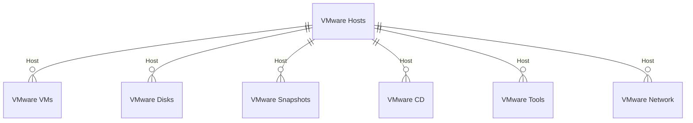
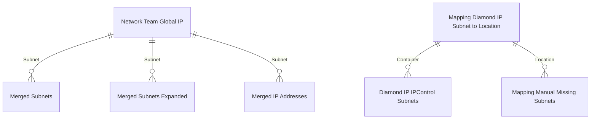
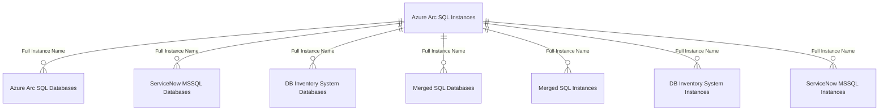

# Module 07: Relationships

## What You'll Learn
All 22 relationships, the 5 clusters, why `_All Devices` has NO relationships.

### Sections:

**1. What Relationships Mean in Power BI**
Relationships in Power BI connect tables so that filtering one table automatically filters related tables. Key concepts:
- **From to To**: The "from" table is the many-side, the "to" table is the one-side (many-to-one)
- **Filter direction**: By default, filters flow from the one-side (To) to the many-side (From)
- **Active vs Inactive**: Only one active relationship can exist between two tables per filter path. Inactive relationships exist but don't automatically propagate filters.
- **Star schema**: The ideal pattern has a central "fact" table surrounded by "dimension" tables. This model has multiple star-like clusters, not one big star.

**2. The 22 Relationships -- Complete List**
Group them into 5 clusters:

**Cluster 1: VMware Detail Tables to VMware Hosts (6 relationships)**
All use the `Host` column to connect detail tables to the VMware Hosts hub:
| # | From Table | From Column | To Table | To Column |
|---|-----------|-------------|----------|-----------|
| 1 | VMware VMs | Host | VMware Hosts | Host |
| 2 | VMware Disks | Host | VMware Hosts | Host |
| 3 | VMware Snapshots | Host | VMware Hosts | Host |
| 4 | VMware CD | Host | VMware Hosts | Host |
| 5 | VMware Tools | Host | VMware Hosts | Host |
| 6 | VMware Network | Host | VMware Hosts | Host |



When you filter by a specific Host in VMware Hosts, all six detail tables automatically filter to show only data for that host.

**Cluster 2: Network/Subnet to Network Team Global IP (3 relationships + 2 more)**
Tables connecting via `Subnet`:
| # | From Table | From Column | To Table | To Column |
|---|-----------|-------------|----------|-----------|
| 7 | Merged Subnets | Subnet | Network Team Global IP Address Allocation | Subnet |
| 8 | Merged Subnets Expanded | Subnet | Network Team Global IP Address Allocation | Subnet |
| 9 | Merged IP Addresses | Subnet | Network Team Global IP Address Allocation | Subnet |

Plus related network relationships:
| # | From Table | From Column | To Table | To Column |
|---|-----------|-------------|----------|-----------|
| 10 | Diamond IP IPControl Subnets | Container | Mapping Diamond IP IPControl Subnet to Location | Container |
| 11 | Mapping Manual Missing Subnets | Location | Mapping Diamond IP IPControl Subnet to Location | Location |



**Cluster 3: SQL Tables to Azure Arc SQL Instances (7 relationships)**
All connected via `Full Instance Name`:
| # | From Table | From Column | To Table | To Column |
|---|-----------|-------------|----------|-----------|
| 12 | Azure Arc SQL Databases | Full Instance Name | Azure Arc SQL Instances | Full Instance Name |
| 13 | ServiceNow MSSQL Databases | Full Instance Name | Azure Arc SQL Instances | Full Instance Name |
| 14 | DB Inventory System Databases | Full Instance Name | Azure Arc SQL Instances | Full Instance Name |
| 15 | Merged SQL Databases | Full Instance Name | Azure Arc SQL Instances | Full Instance Name |
| 16 | Merged SQL Instances | Full Instance Name | Azure Arc SQL Instances | Full Instance Name |
| 17 | DB Inventory System Instances | Full Instance Name | Azure Arc SQL Instances | Full Instance Name |
| 18 | ServiceNow MSSQL Instances | Full Instance Name | Azure Arc SQL Instances | Full Instance Name |



**Cluster 4: Domain Mapping (1 relationship)**
| # | From Table | From Column | To Table | To Column |
|---|-----------|-------------|----------|-----------|
| 19 | Mapping DomainFQDN to DomainNetBIOS | NetBIOS | Mapping DomainNetBIOS to DomainFQDN | NetBIOS |

**Cluster 5: Other (2 active + 1 inactive)**
| # | From Table | From Column | To Table | To Column | Notes |
|---|-----------|-------------|----------|-----------|-------|
| 20 | Application Catalogue Working Catalogue | Application Reference | Application Catalogue Wave Plan | Application Reference | |
| 21 | Mapping VM to ServerName | VM | VMware VMs | VM | |
| 22 | Merged IP Addresses | IP Address (Decimal) | Merged Subnets Expanded | IP Address (Decimal) | **INACTIVE** |

**3. The Inactive Relationship**
Relationship #22 is marked `isActive: false`. This connects Merged IP Addresses to Merged Subnets Expanded via decimal IP addresses. It is inactive because:
- Merged IP Addresses already connects to Network Team Global IP via Subnet (relationship #9)
- If this relationship were active, it would create a circular filter path (ambiguous path)
- Power BI only allows one active path between any two tables
- The relationship exists for potential use with USERELATIONSHIP() in DAX, but is not used by default

**4. The Critical Absence: _All Devices Has ZERO Relationships**
This is the most important design decision in the model. The `_All Devices` calculated table has NO relationships to any other table. Instead, ALL cross-table lookups are done via `LOOKUPVALUE()` in DAX calculated columns.

Why? Because `_All Devices` is a UNION of rows from multiple source tables. If you created a relationship from `_All Devices` to `VMware VMs` on Name, it would only work for rows that came from VMware -- not for rows from Azure, SolarWinds, or Snow. LOOKUPVALUE works regardless of which source the row came from.

This means:
- No automatic filter propagation TO or FROM `_All Devices`
- Every enrichment column must explicitly specify its lookup
- More verbose DAX but more reliable results
- Same pattern applies to `_All Projects Scope` and `_All Applications by Server`

**5. How to Read relationships.tmdl**
```
relationship be452c2b-09be-ba58-59f9-5e9182f46423
    fromColumn: 'VMware VMs'.Host
    toColumn: 'VMware Hosts'.Host
```
- `relationship <GUID>` -- Unique identifier (auto-generated)
- `fromColumn` -- The many-side (detail table)
- `toColumn` -- The one-side (hub/lookup table)
- `isActive: false` -- Only appears on inactive relationships (all others are active by default)

**6. Hands-On Exercise**
1. Open Model view in Power BI Desktop
2. Find the VMware cluster -- see VMware Hosts in the center with 6 tables radiating from it
3. Find the SQL cluster -- see Azure Arc SQL Instances in the center with 7 tables connecting to it
4. Find the Network cluster -- see Network Team Global IP Address Allocation as the hub
5. Look for `_All Devices` -- notice it sits alone with NO connecting lines
6. Double-click on a relationship line to see its properties (from/to columns, active/inactive)
7. Open `relationships.tmdl` in a text editor -- match each entry to what you see in the diagram

**7. Key Takeaways**
- 22 relationships organized into 5 clusters
- Relationships propagate filters from one-side to many-side
- 1 inactive relationship (Merged IP to Merged Subnets Expanded) avoids circular path
- `_All Devices` has ZERO relationships -- uses LOOKUPVALUE instead
- This design choice is intentional: LOOKUPVALUE works across the UNION regardless of source
