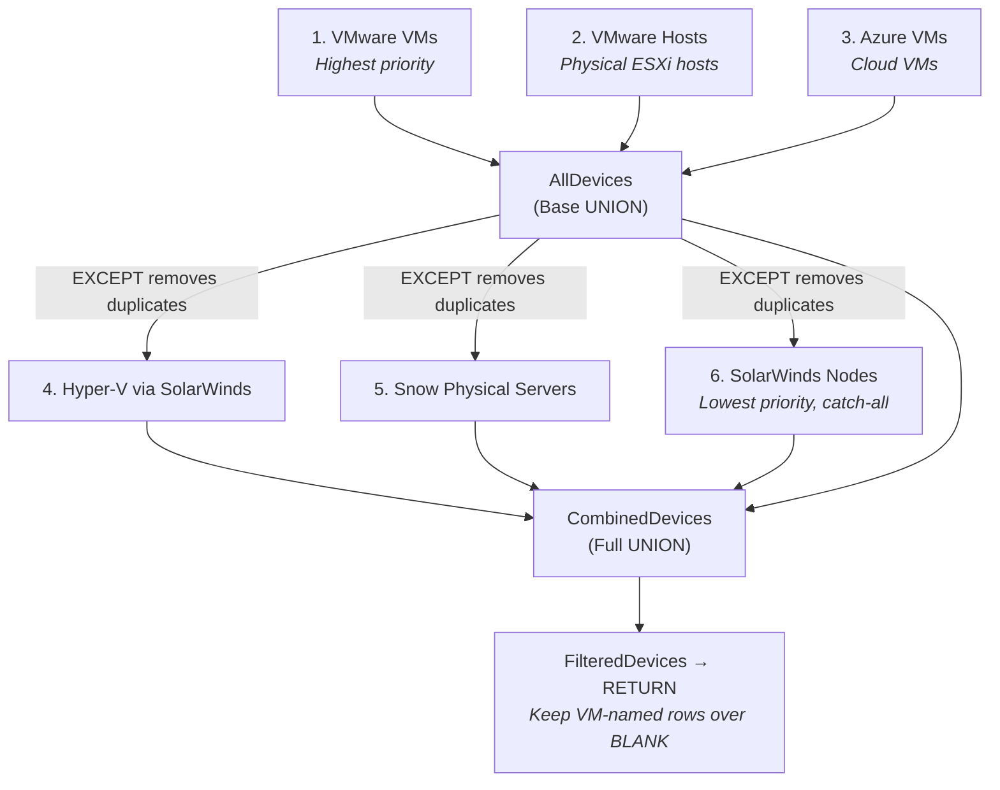

# Module 09: _All Devices -- The UNION Chain

## What You'll Learn
The core calculated table's partition source -- the 7-stage UNION + EXCEPT deduplication engine.

### Sections:

**1. Why _All Devices Exists**
The organization has 15+ IT systems, each tracking servers from their own perspective. No single system has a complete list. `_All Devices` solves this by:
- Combining all servers from all sources into one table
- Deduplicating so each server appears only once
- Enriching each row with data from all source systems (via calculated columns)
- Providing a single authoritative server inventory

**2. The Partition Source -- Full DAX**
Here is the actual partition source from `_All Devices.tmdl` (lines 987-1076). Walk through it step by step:

```dax
VAR AllDevices =
    UNION(
        SELECTCOLUMNS('VMware VMs', "Name", 'VMware VMs'[Name], "VM", 'VMware VMs'[VM]),
        SELECTCOLUMNS('VMware Hosts', "Name", 'VMware Hosts'[Name], "VM", BLANK()),
        SELECTCOLUMNS('Azure VMs', "Name", 'Azure VMs'[Name], "VM", BLANK())
    )
```
**Stage 1 -- AllDevices (Base Foundation):** UNION of three sources: VMware VMs (with VM name), VMware Hosts (physical hosts, no VM), Azure VMs (no VM). Every table is standardized to two columns: Name and VM using SELECTCOLUMNS. VMware Hosts and Azure VMs get BLANK() for VM since they are not virtual machines in VMware.

```dax
VAR SolarWindsVMsFiltered =
    EXCEPT(
        SELECTCOLUMNS(
            FILTER('SolarWinds VMs', 'SolarWinds VMs'[Virtualization Platform] = "Hyper-V"),
            "Name", 'SolarWinds VMs'[Name], "VM", BLANK()
        ),
        SELECTCOLUMNS(AllDevices, "Name", [Name], "VM", BLANK())
    )
```
**Stage 2 -- SolarWindsVMsFiltered (Hyper-V VMs):** Filter SolarWinds VMs to only Hyper-V platform, then EXCEPT removes any that already exist in AllDevices. This adds Hyper-V VMs that are not already tracked by VMware or Azure.

```dax
VAR SnowComputersFiltered =
    EXCEPT(
        SELECTCOLUMNS(
            FILTER('Snow Computers', 'Snow Computers'[Hypervisor] = ""),
            "Name", 'Snow Computers'[Name], "VM", BLANK()
        ),
        SELECTCOLUMNS(AllDevices, "Name", [Name], "VM", BLANK())
    )
```
**Stage 3 -- SnowComputersFiltered (Physical Servers):** Filter Snow Computers to only non-hypervisor entries (Hypervisor = ""), meaning physical servers. EXCEPT removes any already in AllDevices. This catches physical servers not tracked by VMware/Azure/SolarWinds.

Note: The `.dax` development file comments this out, but the live partition (in the .tmdl) includes it.

```dax
VAR SolarWindsNodesFiltered =
    EXCEPT(
        SELECTCOLUMNS(
            FILTER(
                'SolarWinds Nodes',
                (
                    ('SolarWinds Nodes'[Node Category] = "Network" && 'SolarWinds Nodes'[DeviceType] = "Server") ||
                    ('SolarWinds Nodes'[Node Category] = "Other" && 'SolarWinds Nodes'[DeviceType] = "Server") ||
                    ('SolarWinds Nodes'[Node Category] = "Server")
                ) &&
                NOT RIGHT('SolarWinds Nodes'[Name], 2) = "-R"
            ),
            "Name", 'SolarWinds Nodes'[Name], "VM", BLANK()
        ),
        SELECTCOLUMNS(AllDevices, "Name", [Name], "VM", BLANK())
    )
```
**Stage 4 -- SolarWindsNodesFiltered (Server-Type Network Nodes):** The most complex filter. Include SolarWinds Nodes where:
- (Node Category = "Network" AND DeviceType = "Server") OR
- (Node Category = "Other" AND DeviceType = "Server") OR
- (Node Category = "Server")
- AND the Name does not end with "-R" (excludes redundant/router entries)

Then EXCEPT removes those already in AllDevices. This catches any remaining servers only visible to SolarWinds monitoring.

```dax
VAR CombinedDevices =
    UNION(
        AllDevices,
        SolarWindsVMsFiltered,
        SnowComputersFiltered,
        SolarWindsNodesFiltered
    )
```
**Stage 5 -- CombinedDevices (Full UNION):** Combine all four VARs into one table. At this point, near-duplicates may still exist (same Name with VM populated in one row and BLANK in another).

```dax
VAR FilteredDevices =
    FILTER(
        CombinedDevices,
        NOT (
            [VM] = BLANK() &&
            COUNTROWS(
                FILTER(
                    CombinedDevices,
                    [Name] = EARLIER([Name]) &&
                    NOT(ISBLANK([VM]))
                )
            ) > 0
        )
    )
```
**Stage 6 -- FilteredDevices (Final Deduplication):** Removes rows where VM is BLANK if another row with the same Name has a non-BLANK VM. Translation: "If a server appears twice -- once with a VM name and once without -- keep only the one WITH the VM name." This ensures VMware-sourced rows (which have the VM column populated) take priority.

```dax
RETURN
SUMMARIZE(
    FilteredDevices,
    [Name],
    [VM]
)
```
**Stage 7 -- RETURN (Output):** SUMMARIZE produces the final unique rows with just Name and VM columns. All the 30+ calculated columns are then computed on top of this result.

**3. Priority Hierarchy Explained**
The order matters. Each stage only adds servers NOT already present:
1. **VMware VMs** -- Highest priority (core virtualization platform)
2. **VMware Hosts** -- Physical ESXi hosts
3. **Azure VMs** -- Cloud VMs
4. **Hyper-V via SolarWinds** -- Secondary virtualization platform
5. **Snow Physical** -- Physical servers not in any hypervisor
6. **SolarWinds Nodes** -- Lowest priority, catch-all for anything else



**4. The .dax File vs Live Partition**
The development file `DAXQueries\_All Devices.dax` has `SnowComputersFiltered` commented out in the final UNION:
```dax
VAR CombinedDevices =
    UNION(
        AllDevices,
        SolarWindsVMsFiltered,
        // SnowComputersFiltered,
        SolarWindsNodesFiltered
    )
```
But the live partition in `_All Devices.tmdl` includes it. The .dax file is a development workspace -- the .tmdl is the actual model definition. Always trust the .tmdl.

**5. Why EXCEPT Instead of Just FILTER?**
EXCEPT performs set subtraction: "give me rows from A that don't exist in B." This is more efficient and correct than:
- Checking CONTAINS for each row (slower)
- Building complex NOT EXISTS filters
- Risk of missing edge cases

EXCEPT compares on ALL columns of both tables (hence SELECTCOLUMNS to standardize to Name + VM first).

**6. Hands-On Exercise**
1. Open `_All Devices.tmdl` in a text editor
2. Scroll to the partition source (lines ~987-1076)
3. Read through each VAR and match it to the stages described above
4. Open the `.dax` file (`DAXQueries\_All Devices.dax`) -- find the commented-out SnowComputersFiltered
5. In Power BI, go to Data view, then select the `_All Devices` table -- check the row count
6. Compare with `VMware VMs` row count -- _All Devices should have more rows (it includes Azure, SolarWinds, etc.)

**7. Key Takeaways**
- _All Devices builds up a unified server list in 7 stages
- UNION combines sources; EXCEPT removes duplicates already present
- Priority: VMware > Azure > Hyper-V > Snow Physical > SolarWinds Nodes
- The final dedup keeps VM-named rows over BLANK VM rows
- Always trust the .tmdl partition, not the .dax development file
- The two output columns (Name, VM) are the foundation; 30+ calculated columns are added on top
